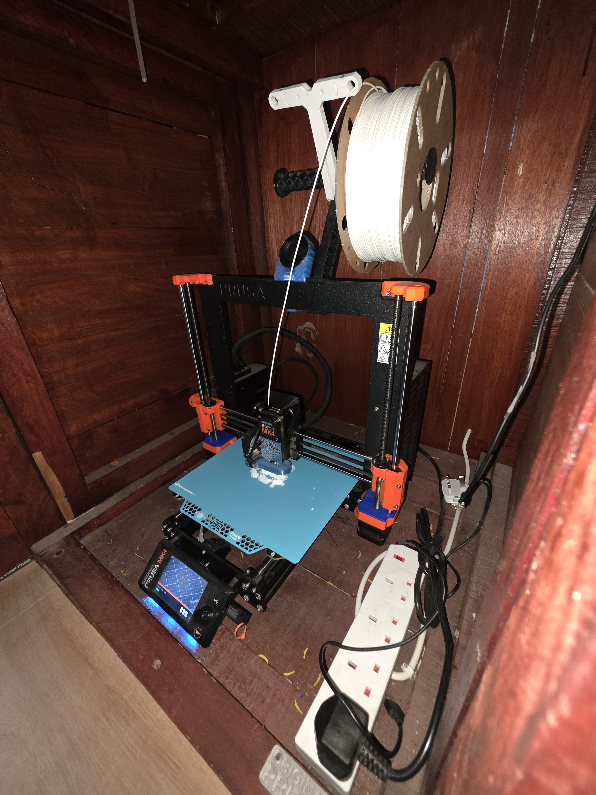
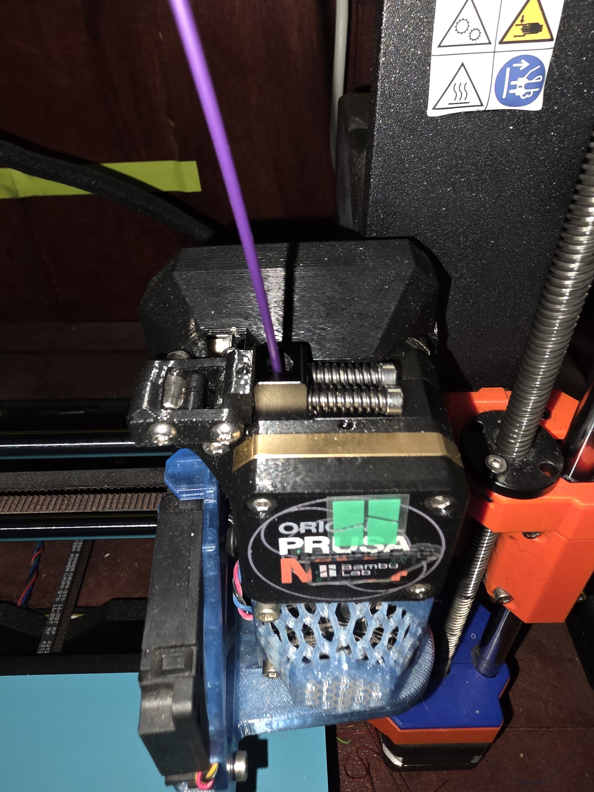

# Using the Prusa MK4

General rules and preparation are covered in [Getting Started](getting_started.md). This page contains Prusa-specific operation. Network addresses and keys are kept on [Connect Your Computer to the Printers](connecting.md).

<figure>
  
  <figcaption>One of the HacMan Prusa MK4 printers.</figcaption>
</figure>

## Slicing

Use PrusaSlicer and the approved HacMan **Prusa MK4, 0.4 mm nozzle** profile. Follow the [PrusaSlicer beginner guide](prusaslicer.md).

## Loading filament

1. Put the spool on the holder so it can turn freely.
2. Cut a damaged or bent filament end cleanly.
3. Select the printer's load-filament function.
4. Insert the filament when prompted and feed gently until the extruder takes it.
5. Confirm that clean filament emerges from the nozzle.

Use the unload-filament function before removing a spool. Never pull filament out by force. Secure the free end immediately.

<figure>
  
  <figcaption>Feed filament gently into the Prusa MK4 extruder when prompted.</figcaption>
</figure>

## Starting a print

On a HacMan PC, select the intended physical printer and use the bottom-right **G** button after slicing and checking Preview. Personal computers can be configured using [the connection instructions](connecting.md). USB export remains an acceptable fallback.

Heating, homing, bed probing and purging are normal. Keep clear and watch the complete first layer.

<figure>
  
  <figcaption>On a HacMan PC, use the bottom-right G button after slicing to send the job to the selected Prusa printer.</figcaption>
</figure>

## Faults

Do not adjust belts, move axes by force, replace nozzles, clear mechanical jams or alter hardware. Stop and report the problem.
