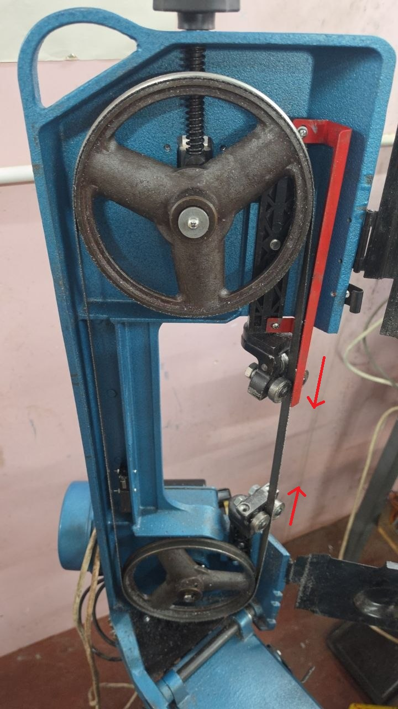
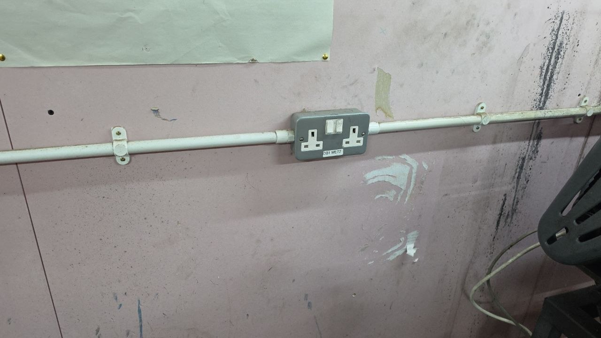
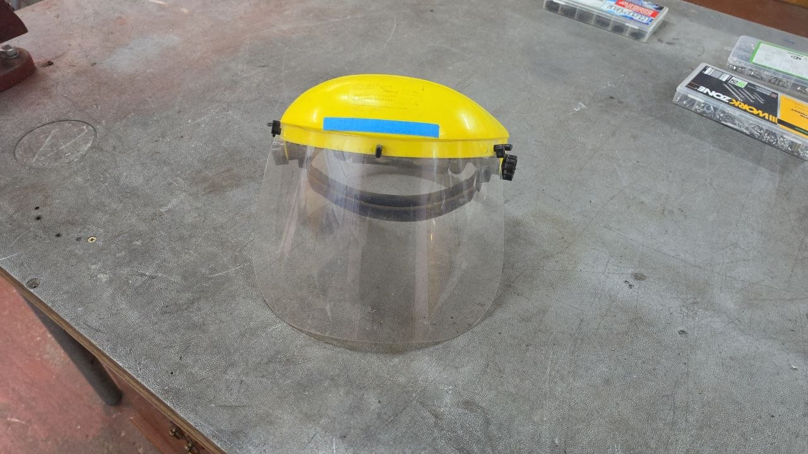
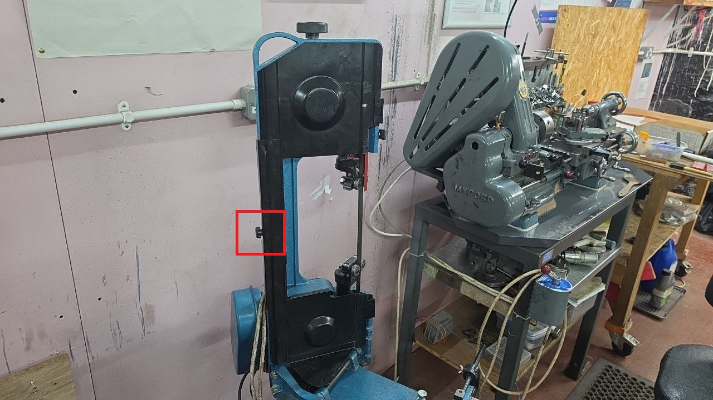
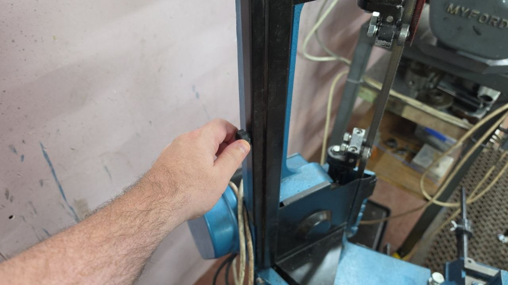
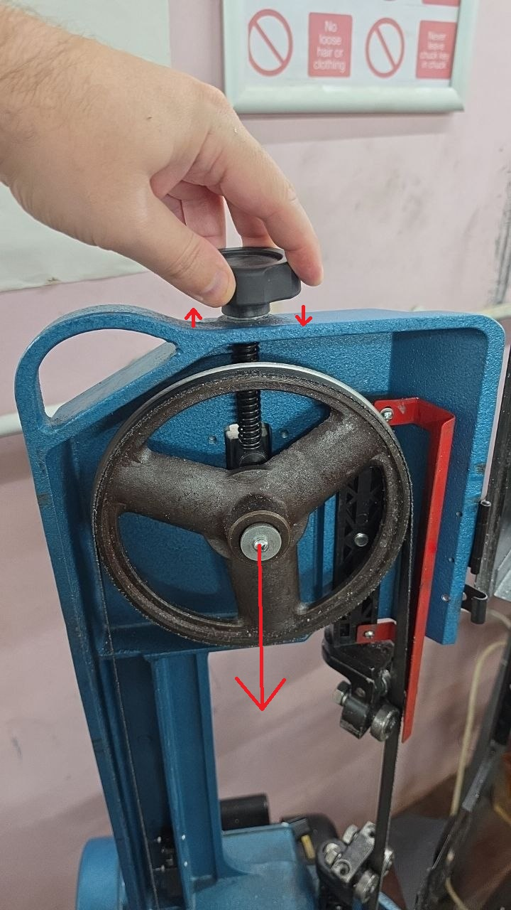
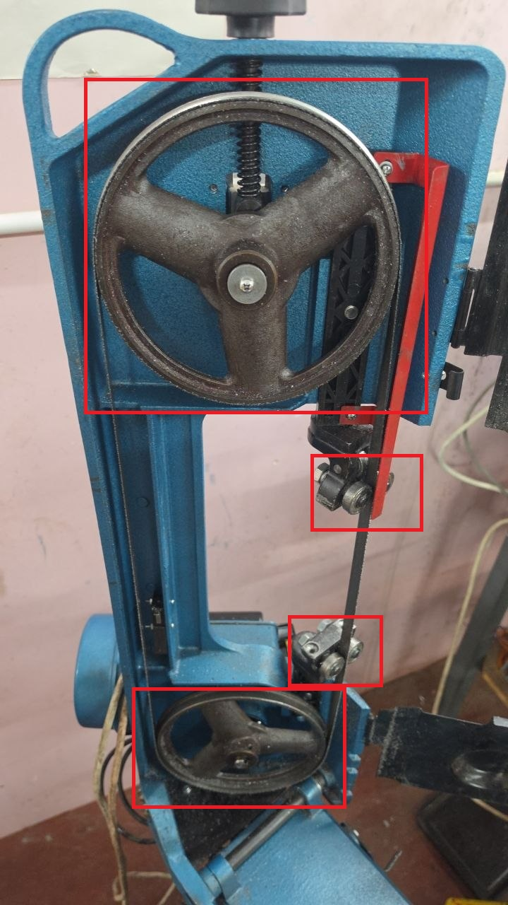

# Fitting the Blade

One of the common problems with cutting on the bandsaw is that the blade can come off sometimes while cutting.
This tends to happen

  * If cutting oil is not used
  * If too much force is placed between the blade and the material
  * When the blade gets close to the bottom of the cutting area
  * when the cutting gap is too wide

Try to reduce the cutting gap as much as you can

For that reason it tends to be common enough to warrant a list of steps on how to refit the blade.
It's not that difficult to do, some steps have been listed below

## Safety

The first step is to make sure the power is disconnected.  
There is a small microswitch to prevent the machine from running if the door is open, but make sure the power is disconnected anyway

Second is to wear some ppe, if the blade has come off the wheel then it can spring out when opening the door

## Opening the Door

Next we need to open the door, we can do this by unscrewing the small black knob on the side

## Refitting the Blade

Once the door is open

  * The knob at the top can be used to loosen / move the tension wheel downwards (by unscrewing it)
  * The blade can then be re-fitted onto the wheels
  * Tension knob can then be re-tightened (don't over tighten)
  * Door can be closed
  * Machine can then be used again.

/// admonition | Important
    type: warning

if the blade is already fitted then loosening the tension will cause the blade to pop off

///

## Blade Position

The blade needs to fit around both wheels and through both sets of bearings

