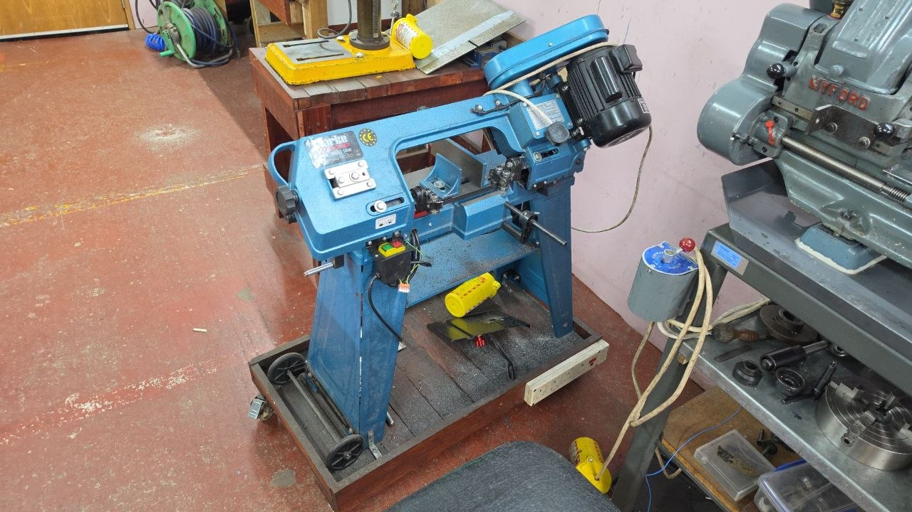

# Metal Bandsaw Overview

The bandsaw is a Clarke CBS45MD, a convertable horizontal / vertical
bandsaw, designed for cutting metal bar, rod and tube down to length. It
has a 1/2hp 370w motor, and is commonly fitted with a 14TPI blade.

  * Can cut mitres from 90°- 45°
  * Cutting capacity - 110mm round, 100mm flat at 90°
  * Quick change horizontal or vertical operating positions with saw table included
  * 370W (0.5hp) motor with combined ON/OFF & safety No-Volt-Release switch
  * 3 cutting speeds 20/29/50 metres per minute with spring tension arm control & adjustable vice for cutting angles 90 degrees - 45 degrees
  * Handle & twin wheels for workshop mobility
  * Dims: 1100x960x1500mm

## Manual

  * [CBS45M Manual](../../../../instruction_manuals/CBS45MD_Bandsaw_Rev_5.pdf)

## Status

The bandsaw is operational.  
For induction see

  * [https://members.hacman.org.uk/equipment/metal-bandsaw-1](https://members.hacman.org.uk/equipment/metal-bandsaw-1)
  * Telegram
  * Mailing List

## Use

### Rules for Use

  - DO NOT press down on the top of the saw while cutting, it will take
    a while. We can't risk burning out the motor again after it cost 90
    quids.
  - DO NOT leave the motor unattended, it is tempting because the saw
    takes a while to get through steel, however if the motor catches /
    can't move then there's a risk again of damage to the motor.
  - DO NOT use the saw for cutting wood.

Generally it's okay to block up the metal part being cut with a small
block of wood underneath. Just try to avoid cutting any wood with it.

### Tips

I've found it's best to block up the metal part being cut underneath
with a small block of wood. The saw will stop once it hits the red stop
button and goes all the way down so it's best to raise the part up
slightly.

Try to use some cutting fluid to help cutting, use a bucket underneath
to catch the oil

### Risk Assessment
[Metal Bandsaw Risk Assessment](https://docs.google.com/document/d/1L63IFT2mtebCvb3mKpEstMLqN3Si-7PQvn6bUsV1nFw/edit?usp=sharing)
