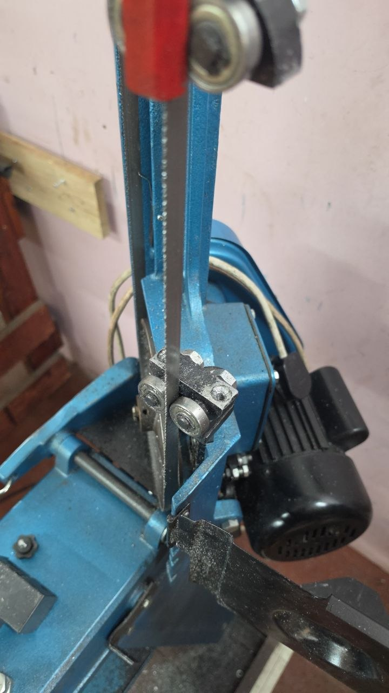
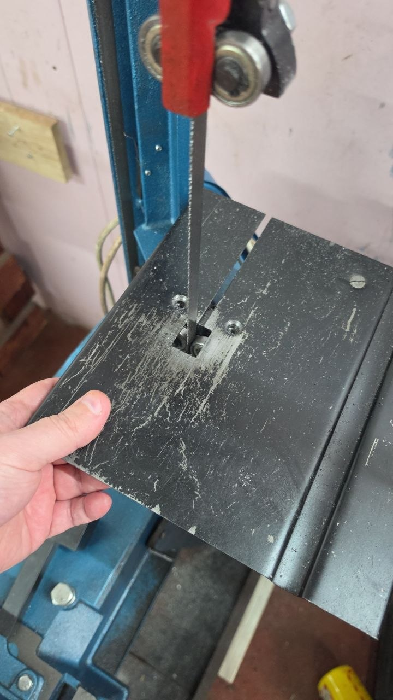

# Vertical Cutting

The band saw can be setup for cutting vertically

/// admonition | Important
    type: warning

Do not loose the screws and do not leave the guard removed

///

  * turn off the Power
  * Open the Door
  * Undo the two screws for the guard

  * Refit the screws for the vertical support plate

